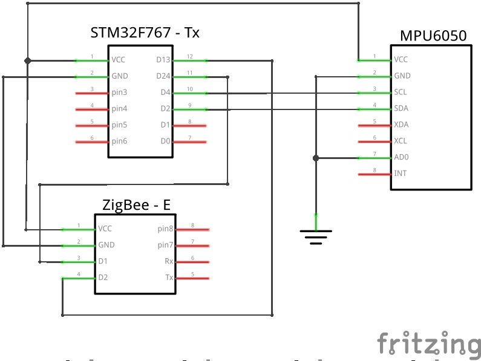
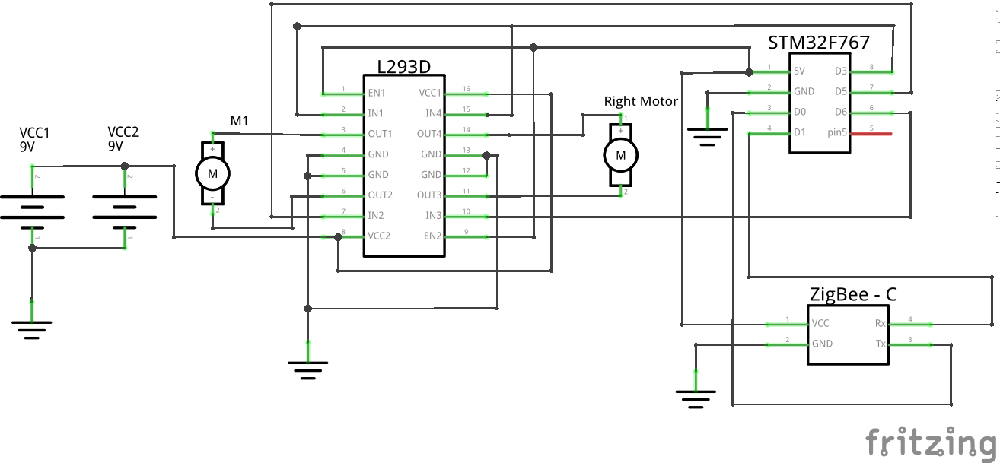

# Gyro based Remote Controlled Car 

## Description

This project was a part of the course Embedded Systems Hardware at Shiv Nadar University. The goal was to build an application using the STM microcontroller.

The following hardware was used for this project:

* 2 STM boards (STM32F303)
* 2 ZigBee modules
* MPU6050 gyro sensor
* L293D motor driver

There were 2 tasks - transmitter side and receiver side. The transmitter side included the remote which would send signals to the receiver. The receiver was the car which would process the signals and move appropriately.

---

## Schematic Diagram

### Transmitter

### Receiver

---

## Demo

Video of the above GIF can be accessed [here](./demo_video.mp4).

---

## Report

A brief report depicting block diagram and errors encountered (and their rectification), which was submitted along with the demo of this project for evaluation can be found [here](./Report_Final_Emedded.pdf).

